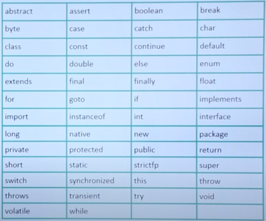
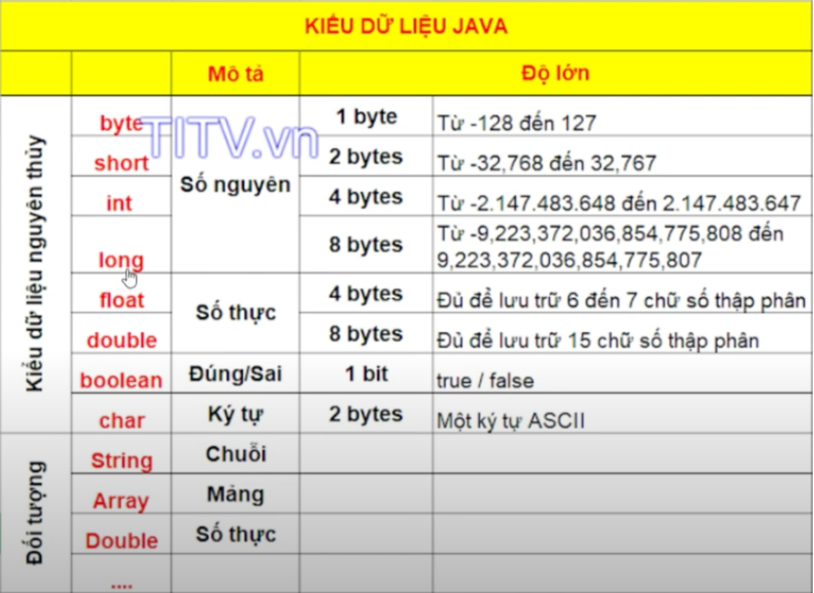
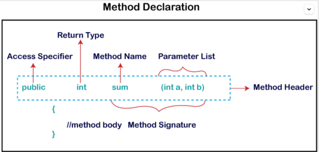

# Backend Java Roadmap

## Table of contents

[I. Fundamentals](#coban)
- [1. Basic syntax]()
- [2. Data types, variables]()
- [3. Conditionals]()
- [4. Functions / Methods]()
- [5. Working with Date / Time]()
___
- [6. Data structure]()
- [7. OOP, interfaces, classed]()
- [8. Packages]()
- [9. Working with Files and APIs]()
___
- [10. Loops]()
- [11. Exception Handling]()

[II. Getting deeper]()
- [1. Memory Management]()
- [2. Collection Framework]()
- [3. Serialization]()
- [4. Networking & Sockets]()
___
- [5. How JVM works?]()
- [6. Garbage Collection]()
- [7. Basic Threads]()
___
- [8. Generics]()
- [9. Streams]()

[III. Build Tools]()
- [1. Gradle]()
- [2. Maven]()
- [3. Ant]()

[IV. Web Frameworks]()
- [1. Spring]()
- [2. Spring Boot]()
- [3. Spark]()
- [4. Quarkus]()

[V. ORM (Object - Relational Mapping)]()
- [1. Spring Data JPA]()
- [2. Hibernate]()
- [3. EBean]()
- [4. JPA()]()

[VI. JDBC]()
- [1. JDBI3]()
- [2. JDBC Template]()

[VII. Logging Frameworks]()
- [1. SLF4J]()
- [2. TinyLog]()
- [3. Logback]()
- [4. Log4j2]()

[VIII. Testing]()
- [1. Unit Testing]()
  - [1.1. JUnit]()
  - [1.2. TestNG]()
- [2. Integration Testing]()
  - [2.1. REST Assured]()
  - [2.2. JMeter]()
- [3. Behavior Testing]()
  - [3.1. Cucumber - JVM]()
  - [3.2. Cukes]()
  - [3.3. JBehave]()

===========================

<a name="coban"></a>
## I. Fundamentals
### 1. Basic syntax
- **Java is case sensitivity**: Phân biệt rõ ràng chữ viết hoa và thường (Ví dụ: `Hello` và `hello`)
- **Class Names**: PascalCase (Ví dụ: `class MyFirstJavaClass`)
- **Method Names**: camelCase (Ví dụ: `public void myMethodName()`)
- **File Name**: PascalCase Exactly match the **Class Name** (Ví dụ: `MyFirstJavaClass.java`)
- **Java Identifiers**: 
  - Identifiers: are the names [variables](), [methods](), [classes](), [packages](), [interfaces]().
  - Named start with:
    - (_A_ to _Z_ or _a_ to _z_)
    - $ (ví dụ: `$result`)
    - _ (Ví dụ: `_value`)
- **Java Keywords**

- **Comments**
  - Single-line comments
  ```java
  // This is single comment
  ```
  - Multi-line comments: <br>
  ```java
  /*
    My first comment 
    This is an example
  */
  ```

### 2. Data types, Variables
- **Data Types** được chia làm 2 loại:
  - Primitive Data Types (Kiểu dữ liệu nguyên thủy)
  - Non-Primitive Data Types (Kiểu dữ liệu không nguyên thủy)

- **Java variables** được chia làm 3 loại:
  - **Local** variables: là biến được tạo và sử dụng bên trong method
  - **Instance** variables: là biến được tạo từ bên ngoài method, là một đối tượng cụ thể
  - **Static** variables: Khởi tạo chỉ duy nhất 1 lần lúc bắt đầu thực thi và được khai báo đầu tiên
```java
class Guru99 {
  static int a = 1; //static variable  
  int data = 99; //instance variable  
  void method() {
    int b = 90; //local variable  
  }
}
 ```

**_❖ Type conversion & Type Casting_**
- **Type conversion**: Biến có dung lượng nhỏ hơn được gán vào biến khác có dung lượng lớn hơn
```java
double d;
int i = 10;
d = i; __________________________// Chuyển kiểu dữ liệu - Type conversion 
```
- **Type Casting**: Gán biến có dung lượng lớn vào biến khác có dung lượng nhỏ hơn

```java
double d = 10;
int i;
i = (int) d; ____________________// Ép kiểu - Type Casting
```
### 3. Conditionals
- if … else if ... else 
```java
public static void Weather(string myDay)
{
  if (myDay == " Sunny") // 1st condition
  {
    Console.WriteLine("Read in the Library");
  } else if (myday == "Raining") // 2nd condition
  {
    Console.WriteLine("Read at Home");
  } else // 3rd condition
  {
    Console.WriteLine("Read in the Garden");
  }
} 
```
- switch … case
```java
static void Main(string[] args)
{
  int myDay = 4; // setting the value to test
  switch (myDay)
  {
    case 1:
      Console.WriteLine("Read in the Library");
      break;
    case 2:
      Console.WriteLine("Read at Home");
      break;
    case 3:
      Console.WriteLine("Read in the Garden");
      break;
    default:
      Console.WriteLine("Get some Sleep");
      break;
  }
} 
```
- Loops
```java
 static void Main(string[] args)
{
    int n;
    while (n < 10) {
        // execute action
        n++;
    }
    
    // ===========================
  
    do {
        n++;
        // execute action
    } while (n < 10);

    // ===========================
  
    for (int i = 0; i < 10; i++) {
        // execute action
    }
} 
```

### 4. Functions / Methods
- **‘DRY’ principle**: Do not repeat yourself

- Access Specifier (Phạm vi truy cập)

| Modifier  | Class (.java) | Package (📂java) | Child class | Global |
|-----------|---------------|------------------|-------------|--------|
| private   | ✅            | ❌               | ❌          | ❌     |
| default   | ✅            | ✅               | ❌          | ❌     |
| protected | ✅            | ✅               | ✅          | ❌     |
| public    | ✅            | ✅               | ✅          | ✅     |

- Có 2 loại methods chính:
  - Predefined Method (được định nghĩa trước)
  - User-defined Method (được người dùng định nghĩa)
```java
public class Demo {
    
    // Predefined Method
    public static void main(String[] args) {
        // using the max() method of Math class 
        System.out.print("The maximum number is: " + Math.max(9,7)); // Output: 9
    }

    // user defined method
    public static void findEvenOdd(int num) {
      //method body
      if (num % 2 == 0) {
        System.out.println(num + " is even");
      } else {
        System.out.println(num + " is odd");
      }
    }
}
```
- Trong đó, mỗi method sẽ có 4 dạng:
  - **Static Method**: Là phương thức được khai báo với từ khóa static và có thể được gọi trực tiếp từ lớp mà không cần tạo instance (đối tượng) của lớp đó.
  - **Instance Method**
    - **Accessor Method** (getter methods => alway return a value of needed value)
    - **Mutator Method** (setter methods => not return any things, it simply set value to a variable inside method)
  - **Abstract Method**
  - **Factory Method**: Là một phương thức được sử dụng để tạo ra các đối tượng, thường nằm trong một lớp và ẩn đi sự phức tạp của việc tạo ra đối tượng cụ thể. Ý tưởng là cung cấp một cách có kiểm soát để tạo ra đối tượng của một lớp nào đó, thay vì dùng trực tiếp new.
```java
// Example Factory Method
public class ShapeFactory {
  public static Shape createShape(String type) {
    if (type.equals("circle")) {
      return new Circle();
    } else if (type.equals("square")) {
      return new Square();
    }
    return null;
  }
}

Shape shape = ShapeFactory.createShape("circle"); // Gọi qua factory method.
```